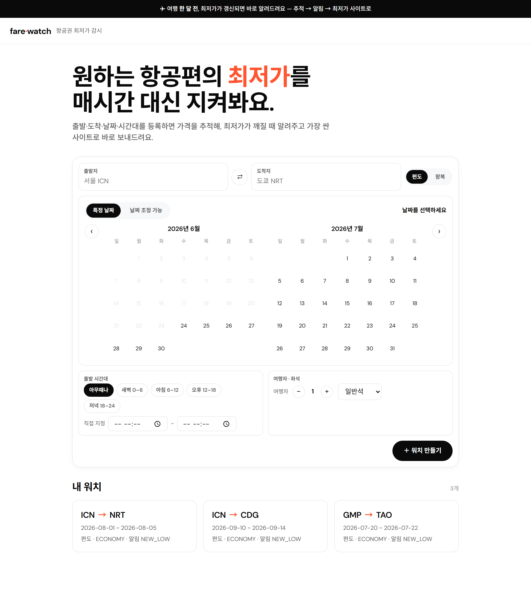
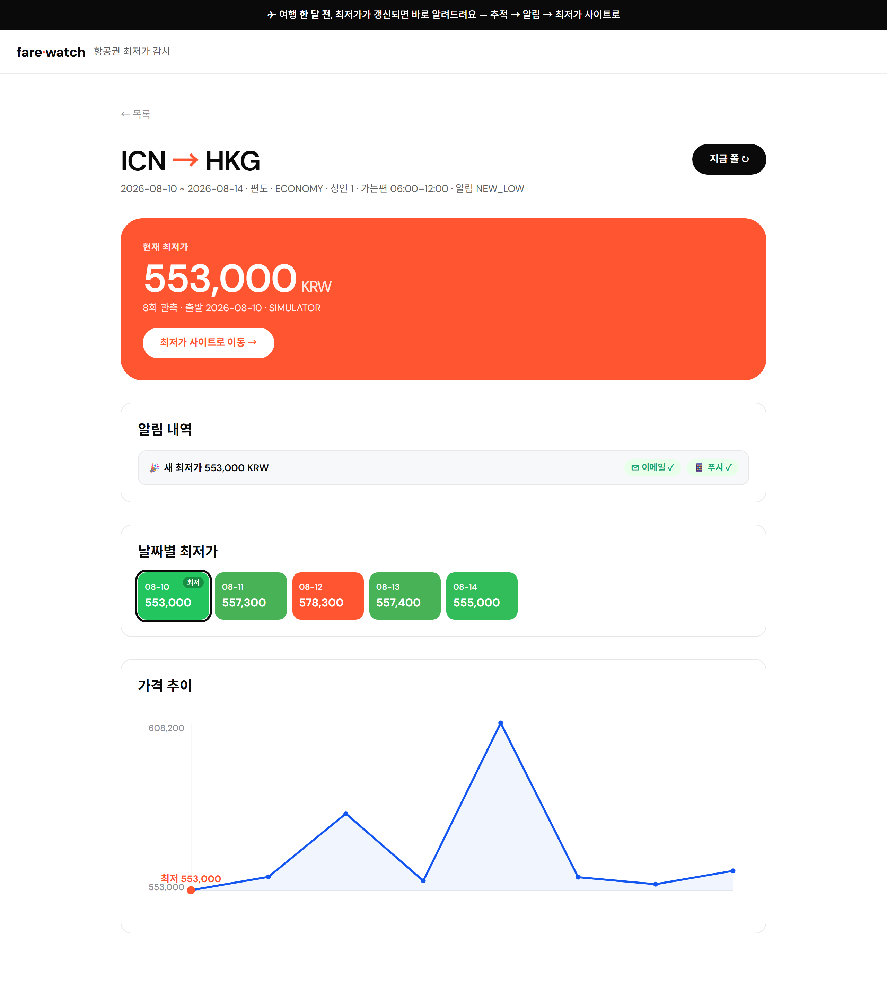
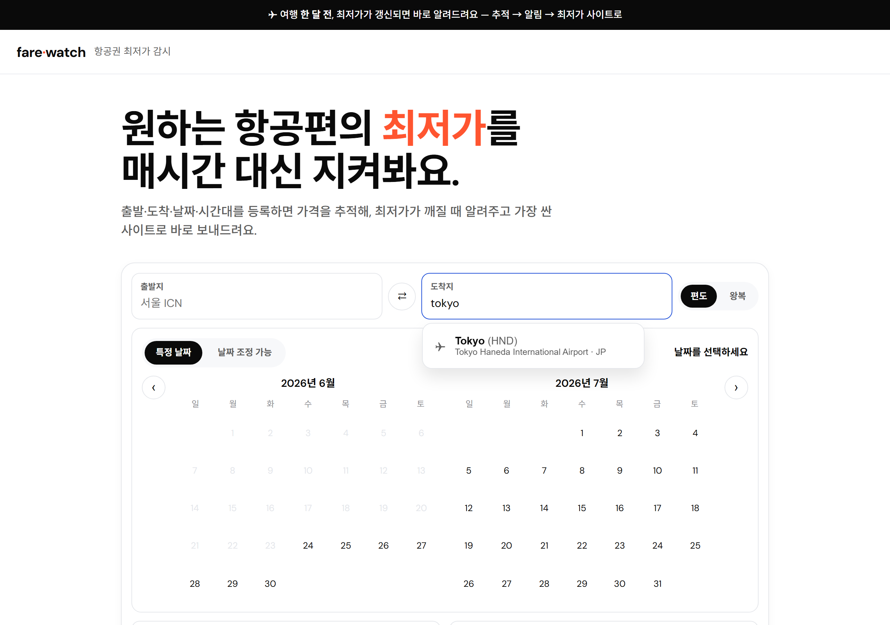
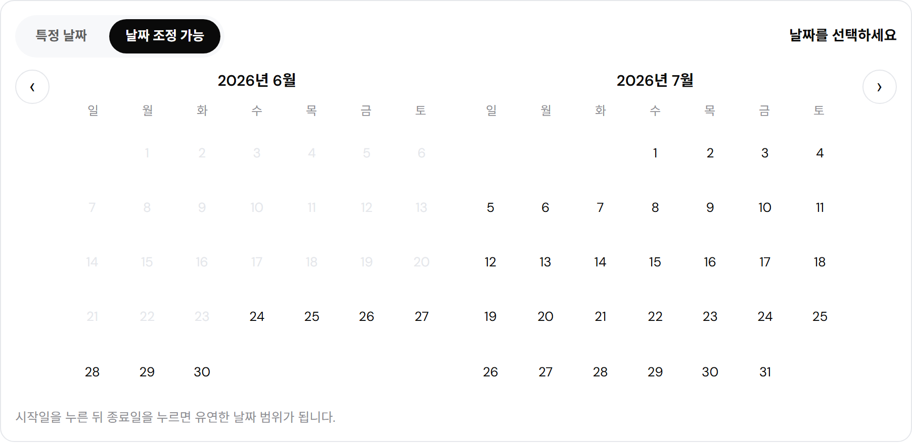
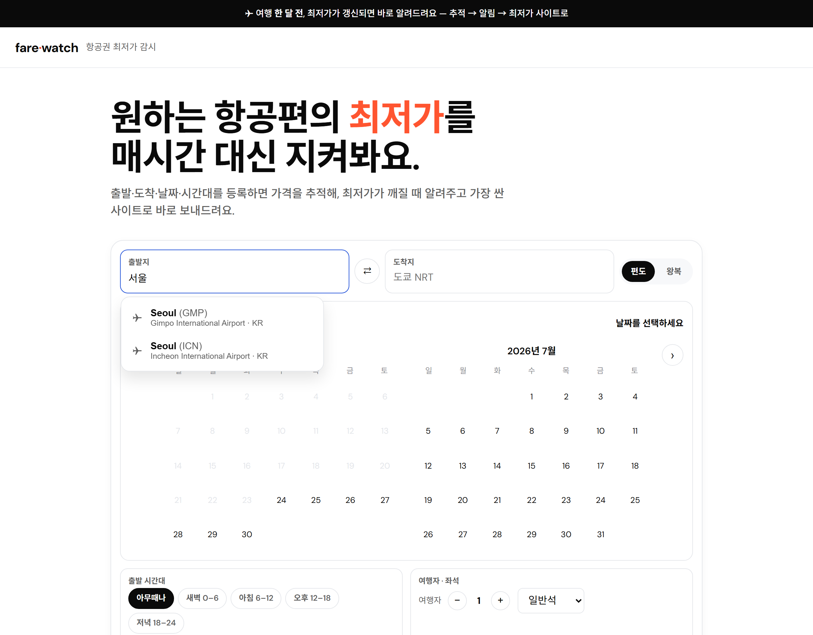
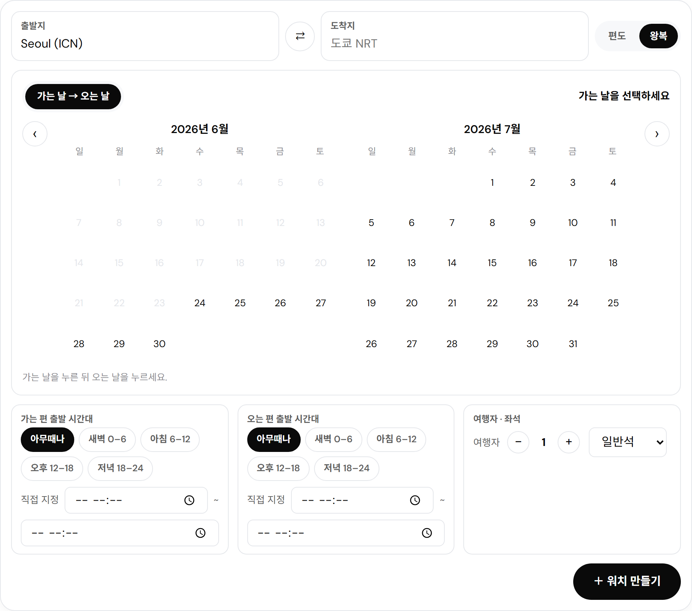
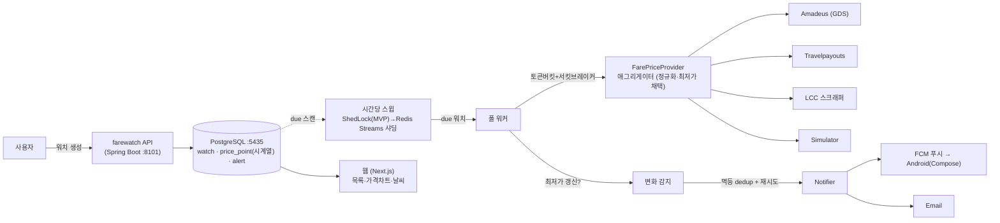

# farewatch

> 원하는 날짜·도시의 항공권 최저가를 **매시간 추적**하다가, 최저가가 깨지면 **알림 → 최저가 사이트로 바로 이동**시켜 주는 메타서치. 한 달 전쯤 여행을 계획하는 사람을 위한 가격 감시 엔진.

[](https://github.com/jinwovo/farewatch/actions/workflows/ci.yml)
&nbsp;·&nbsp; Java 21 · Spring Boot 4.1 · PostgreSQL · Redis · Next.js · Kotlin(Android)

---

## 데모 (Demo)

| 워치 만들기 — 공항 자동완성·유연 날짜·시간대 | 워치 상세 — 최저가·**알림 내역**·히트맵·추이 |
|:--:|:--:|
|  |  |
| **공항 자동완성** (근처공항·거리, OurAirports 실데이터) | **유연 날짜 캘린더** (특정/조정가능) |
|  |  |
| **한국어 검색** (전 세계, Wikidata + 큐레이션) | **왕복** (가는/오는 날 + 가는/오는 시간대) |
|  |  |

> 입력 UX는 스카이스캐너에서 빌려오되 출력은 **워치 → 가격 추적 → 알림 → 최저가 사이트 딥링크**. 디자인 시스템: 스타크 화이트 캔버스 + DM Sans + 블랙 필 CTA + 하나의 비비드 코랄 "현재 최저가" 카드.

---

## 문제 (Problem)

여행을 한 달 전쯤 계획하면, 그 사이 항공권 가격은 **하루에도 몇 번씩 출렁인다**. 사람이 매시간 새로고침할 순 없다.
`farewatch`는 사용자가 등록한 **노선 + (유연한) 날짜 + 알림 규칙**을 대신 감시한다 — 여러 가격 소스를 매시간 폴링해 최저가를 모으고, **최저가가 갱신되면** 푸시/이메일로 알린 뒤 **그 가격을 파는 사이트로 딥링크**한다. 예약·결제는 그 사이트에서 한다(스카이스캐너와 같은 **메타서치** 모델).

## 설계 (Design)



## 핵심 근육 (What this proves)

단순 가격 크롤러가 아니라 **분산 가격-감시 엔진**이 심장:
- **중복 없는 분산 스케줄링** — N개 인스턴스에서 시간당 폴링을 ShedLock 분산락(MVP) → Redis Streams 큐 샤딩(스케일)으로 *정확히 한 번* 실행
- **레이트리밋된 외부 API 보호** — 소스별 토큰버킷 + 서킷브레이커(resilience4j) + 죽은 소스 폴백
- **멀티소스 정규화** — 이종 소스(GDS·애그리게이터·LCC 스크래퍼·시뮬레이터)를 하나의 `FarePriceProvider`로 합류해 최저가 채택
- **멱등 알림** — `dedup_key`로 같은 하락을 두 번 쏘지 않음 + 재시도 (멀티채널: FCM 푸시 / Email)

## 검증 (Verification)
> 말이 아니라 실행으로 증명 — 채워지는 중 (로드맵 참고)

- [x] 다른 인스턴스가 락 보유 시 **중복 폴링 0** (Redis 분산락 통합 테스트)
- [x] 컨슈머그룹 **샤딩** — 두 워커가 잡 분할, 각 워치 정확히 1회 폴 (QueueShardingIntegrationTest)
- [x] **토큰버킷** 레이트리밋(버스트→거부) + **서킷브레이커**(직접 구현) 보호
- [x] 적응형 폴링 — 예산 < due 시 **고가치 워치 우선** 큐잉 (AdaptiveSweepIntegrationTest)
- [x] 알림 **멀티채널 발송**(이메일·푸시) — 아웃박스 + 재시도→FAILED + dedup (NotificationDispatchTest)
- [x] 폴 **부하 테스트** — k6 30VU: **~145 polls/s · p95 211ms · 0% 에러** (`load/k6-poll.js`)
- [ ] 웹 데모 GIF + Android 푸시 수신 화면

## 스택 (Stack)

| 영역 | 기술 |
|---|---|
| 언어/프레임워크 | Java 21 · Spring Boot 4.1 (Jackson 3) · Gradle |
| DB | PostgreSQL 16 + Flyway · `ddl-auto: none` · `open-in-view: false` · `price_point` 시계열 |
| 스케줄/락 | `@Scheduled` 매시간 + **Redis 분산락**(`SET NX PX` + Lua release) → Redis Streams 샤딩 *(P2 / P4)* |
| 회복탄력성 | 토큰버킷 레이트리밋 · resilience4j 서킷브레이커 *(P4)* |
| 알림 | FCM 푸시 · Email · `dedup_key` 멱등 + 재시도 *(P3)* |
| 외부 소스 | Amadeus · Travelpayouts · LCC 스크래퍼(Playwright) · Open-Meteo 날씨 |
| 프론트 | 웹 Next.js · **Android Kotlin + Jetpack Compose** |
| 관측 | Micrometer + `/actuator/prometheus` |
| 테스트 | Testcontainers (`@ServiceConnection`) |

## 가격 소스 전략 (Sources)

| 소스 | 잡는 재고 풀 | 도입 |
|---|---|---|
| Amadeus Self-Service | 레거시 항공사 (GDS) | P4 |
| Travelpayouts (Aviasales) | 폭넓은 캐시 최저가 + 가격이력 | P4 |
| LCC 1곳 스크래퍼 (Playwright) | GDS가 못 잡는 LCC 직판 | P4 (옵션·기본 off) |
| Simulator | 합성 가격워크 (부하·상시 데모) | P1 |

> ⚠️ **정직성 노트:** 공개 항공권 가격 API는 사실상 없다(스카이스캐너 = 파트너 전용, 구글 플라이트 = API 없음). 그래서 `farewatch`는 **합법적으로 접근 가능한 상보적 소스**(Amadeus 무료 테스트티어 + Travelpayouts 제휴 + LCC 1곳 스크래퍼)를 `FarePriceProvider`로 합류하고, 부하테스트·상시 데모는 **Simulator**로 돌린다. 엔진(스케줄·레이트리밋·dedup·알림)은 소스와 무관하게 동일하다. 가격 분산의 대부분은 *서로 다른 재고 풀* 몇 개로 잡히며, 같은 GDS를 되파는 사이트를 더 긁는 것은 커버리지가 아니라 유지보수만 늘린다(→ [ADR-0002](docs/adr/0002-multi-source-fare-aggregator.md)).

## Quickstart

```bash
# 1) 인프라 (PostgreSQL)
docker compose up -d

# 2) 앱 (포트 8101)
./gradlew bootRun

# 3) 헬스체크
curl http://localhost:8101/actuator/health

# 4) 웹 (포트 3005 · /api/* → :8101 프록시 · 의존성 없는 SVG 차트)
cd web && npm install && npm run dev
```

### API (P1)

| 메서드 · 경로 | 설명 |
|---|---|
| `POST /api/watches` | 워치 생성 (노선·유연 날짜·알림 규칙) |
| `GET /api/watches` | 목록 (`?userRef=` 필터) |
| `GET /api/watches/{id}` | 단건 |
| `DELETE /api/watches/{id}` | 삭제 |
| `POST /api/watches/{id}/poll` | 지금 폴 — 소스별 최저가 적재 + `newLow` 판정 |
| `GET /api/watches/{id}/prices` | 가격 이력(시계열) |

## 로드맵

- [x] **P0** 스캐폴드 — Boot 4.1, PostgreSQL, Flyway 스키마, Testcontainers, CI, ADR
- [x] **P1** 도메인 + 소스추상화 — 워치 CRUD, `FarePriceProvider`(Simulator), 가격이력 시계열, 웹(Next.js 목록·생성·가격차트)
- [x] **P2** 분산 스케줄 — 시간당 스윕 + **Redis 분산락**, "락 보유 중 중복폴링 0" 테스트, 변화감지 → `price_alert`(dedup_key 멱등) ⭐
- [x] **P3 (알림)** — 트랜잭션 **아웃박스** + 디스패처(멱등 dedup · 재시도→FAILED) · 이메일/푸시 **멀티채널**(로그 sender, FCM/SMTP 드롭인) · `/alerts` 발송이력 ✅ · *남음: Android(Compose) 앱 — Android SDK 필요*
- [x] **P4 (스케일)** — Redis Streams 샤딩 · 토큰버킷 레이트리밋 · 서킷브레이커 · **적응형 폴링** · k6(~145 polls/s) ✅ · *남음: Amadeus/Travelpayouts 실어댑터, 딜 점수, k3d 멀티팟*
- [ ] **P5** 날씨 + 폴리시 — Open-Meteo 평년값 → D-16 실예보 크로스오버, 메트릭/Grafana, 데모GIF·Android 녹화

## ADR

- [ADR-0001 — ADR 시작 & 스택/포트](docs/adr/0001-record-architecture-decisions.md)
- [ADR-0002 — 멀티소스 운임 애그리게이터 & 소스 전략](docs/adr/0002-multi-source-fare-aggregator.md)
- [ADR-0003 — 분산 폴링: ShedLock → Redis Streams](docs/adr/0003-distributed-polling.md)
